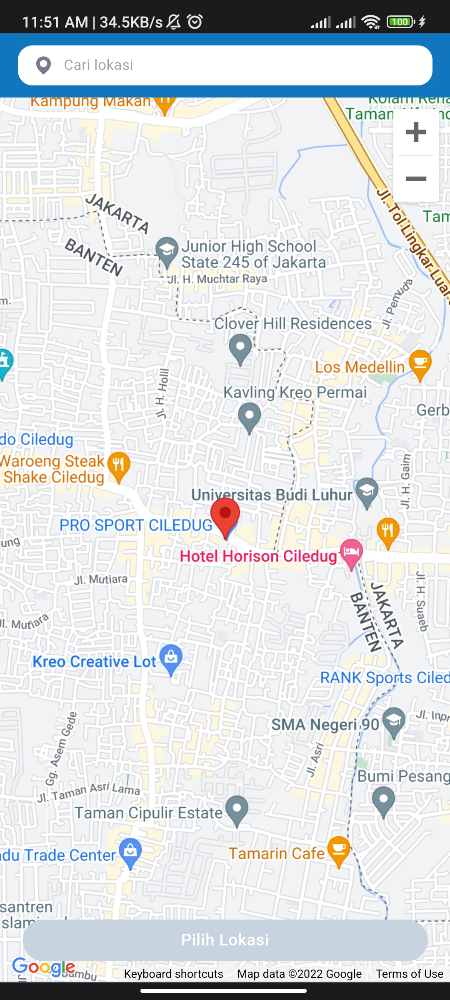
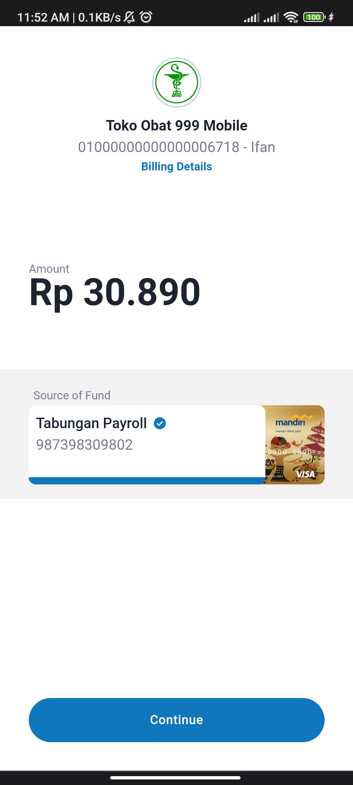
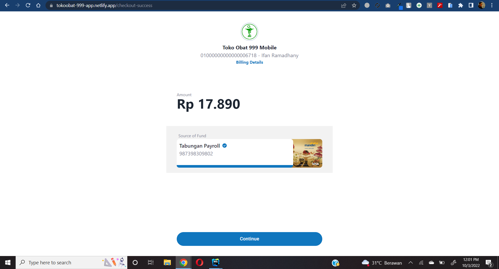

## Project Toko Obat App

Toko Obat App

An application is a responsive mini app that selling medicine, means still showing good / properly whether you open
it on Website or on Smartphone, users need to complete data for finish the transaction. I also
include the app with Google Maps API. so users can field his address easily. all data is just dummny. Built with React,
Redux, Typescript, Material UI, Tailwind and SCSS. Addition, I add dark mode feature on the app.

I made this app for a portfolio

## Project Screen Shot(s)

### on smartphone

### on website

## Deployment

I deployed this app on Netlify
and here's the app domain where you can see the app in detail:

`https://tokoobat-999-app.netlify.app`
